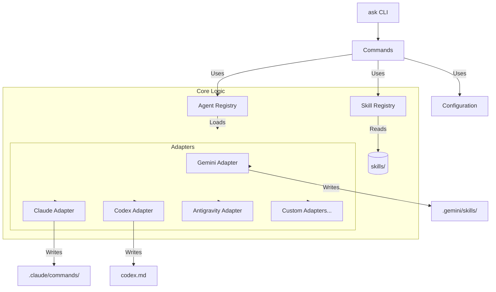

# Architecture Overview

Agent Skill Kit (ASK) is designed as a centralized package manager for AI skills. It follows a modular architecture to support multiple AI agents through a common interface.

## Core Components

## Key Modules

### 1. `ask.cli`
The entry point using `click`. Handles command parsing, global flags (like `--verbose`), and configuration loading.

### 2. `ask.commands`
Contains the implementation of each CLI command (`create`, `copy`, `list`, `sync`, `update`, `validate`). Commands interact with registries to perform actions.

### 3. `ask.utils.skill_registry`
Responsible for discovering skills in the `skills/` directory, parsing `skill.yaml` metadata, and resolving instruction files (`SKILL.md` or `README.md`).

### 4. `agents.base.BaseAdapter`
The abstract base class for all agent adapters. It enforces the "Safe Copy" protocol:
- **`get_target_path()`**: Determines where a skill should be installed.
- **`transform()`**: Converts the standard skill format into the agent-specific format.
- **`copy_skill()`**: Handles the actual file writing, conflict detection, and backup logic.

### 5. `agents.*` (Adapters)
Concrete implementations of `BaseAdapter` for specific AI tools. Each adapter knows the directory structure and file format of its target agent.

## Data Flow (Copy Operation)

1. **User** runs `ask copy gemini --skill ask-bug-finder`.
2. **CLI** loads configuration and initializes logging.
3. **Command** calls `get_skill("ask-bug-finder")` from `SkillRegistry`.
4. **Command** gets `GeminiAdapter` from `AgentRegistry`.
5. **Adapter** determines target path (e.g., `.gemini/skills/ask-bug-finder/SKILL.md`).
6. **Adapter** checks for conflicts (safe copy).
7. **Adapter** transforms the skill content (adds frontmatter).
8. **Adapter** writes the file and installs any resources.
